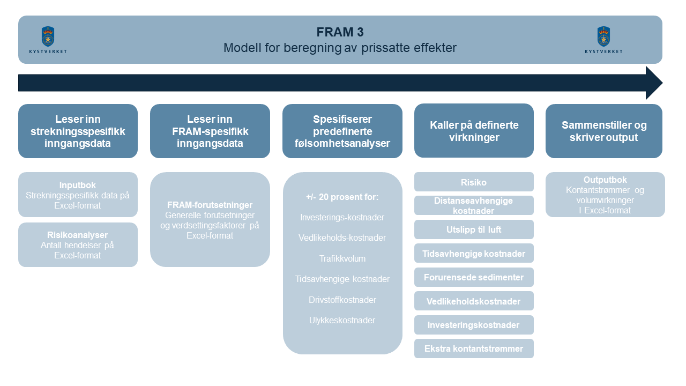

==========================
Dokumentasjon av FRAM 3
==========================
Velkommen til dokumentajsonen av FRAM 3. Dokumentasjonen er bygget opp med følgende stuktur

.. toctree::
   :maxdepth: 1

   Forsiden <index>
   Brukerguide til FRAM-modellen <fram_modell>
   Om hver enkelt virkning som beregnes <virkninger>
   Prinsippet bak virkningene og guide for å lage nye virkninger <lage_virkninger>
   Kildekoden <fram>

Kort oversikt over FRAM
-------------------------
FRAM er bygget opp som én hovedmodell som leser input fra en Excel-fil. Basert på input fra Excel, kaller FRAM på de ulike virkningene, som er ansvarlige for beregninger, kalkulasjonspriser osv. FRAM er altså kun et nav, mens logikken for hver virkning bor i virkningene. Dette sikrer modularitet, ved at virkninger lett kan endres på eller tas med til andre analyser.

Under ser du en oversikt over hva som kalles når du kaller på FRAM

En oversikt over hvilke SØA-metoder som kaller hvilke andre. `FRAM.__init__` er den som kalles ved opprettelse, mens `FRAM.run` kalles for å kjøre modellen.

FRAM krever Python >=3.10 for å kjøre.

